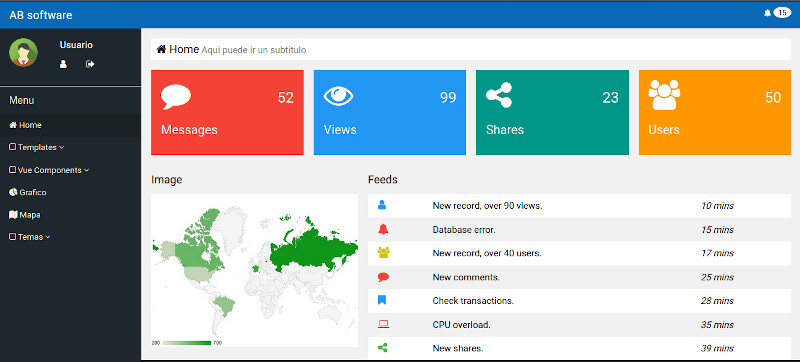

# Plantilla web para front-end
Esta es un plantilla front-end para utilizar en el desarrollo de una aplicacion web o un sistema web. Utiliza como base W3CSS y Vuejs.

## Comenzando 🚀

### Pre-requisitos 📋

Servidor web en funcionamiento.

### Instalación 🔧

Puedes clonar este repositorio o descargar el codigo fuente.
Luego copias los archivos dentro del directorio raiz de tu servidor.

## Construido con 🛠️

* [W3CSS](https://www.w3schools.com/w3css/) - El framework CSS usado.
* [Vue.js](https://vuejs.org/v2/guide/) - El framework JS usado.
* [Font Awesome](https://fontawesome.com/v4.7.0/icons/) - Set de iconos usado.
* [Font Roboto](https://fonts.googleapis.com/css?family=Roboto&display=swap) - Fuente utilizada.

## Autores ✒️

**AB software** - *Idea y desarrollo* - [zeus76ar](https://github.com/zeus76ar) - absoft.dev@gmail.com

## Licencia 📄

Este proyecto está bajo la Licencia (GNU GPL v3.0) - mira el archivo [LICENSE](LICENSE) para mas detalles

## Expresiones de Gratitud 🎁

* Gracias a los desarrolladores de los componentes en Vue.js que se utilizan en este proyecto.
* Gracias a [w3schools](https://www.w3schools.com/w3css/tryw3css_templates_analytics.htm) por el template que sirve de base a este proyecto.